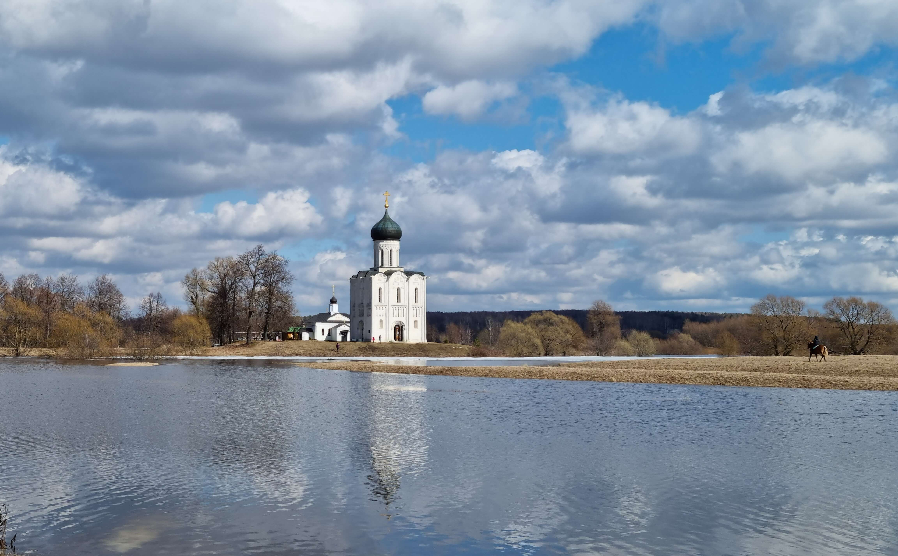

# Проект: Путешествие по России

[Ссылка на страницу](https://vkharlakov.github.io/mesto/)

### Обзор
* Общая информация
* Figma
* Фото-элементы

**Общая Информация**

Проект посвящен реализации фотогалереи на web-странице с возможностью настраивать свой профиль и управлять контентом страницы.

Сайт структурирован по методологии БЭМ, имеются активные кнопки для настройки профиля, а также динамичная grid-система для выстраивания фотографий в соответствии с размерами экрана, на будущее отложена возможность отмечать понравившиеся фотографии. Сайт функционирует как на широкоформатных экранах с большим разрешением, так и на экранах маленьких смартфонов.

**Figma**

Дизайн проекта был полностью взят с макета из Figma, все указанные размеры учтены с малейшими погрешностями. [Ссылка на макет в Figma](https://www.figma.com/file/2cn9N9jSkmxD84oJik7xL7/JavaScript.-Sprint-4?node-id=0%3A1)

**Фото-элементы**

*Примечание: все картинки на сайте были оптимизированы с помощью бесплатного сервиса TinyPNG.com*

